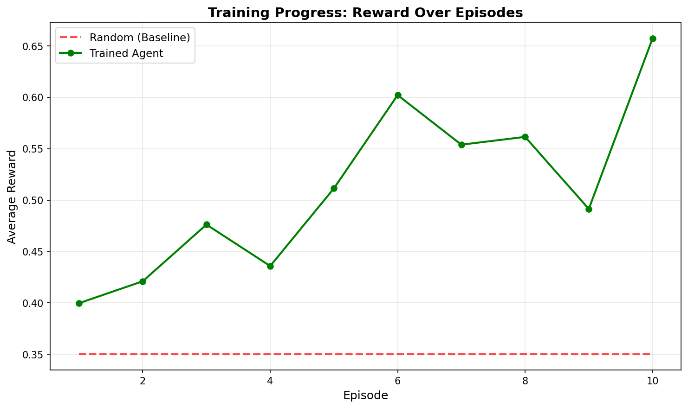
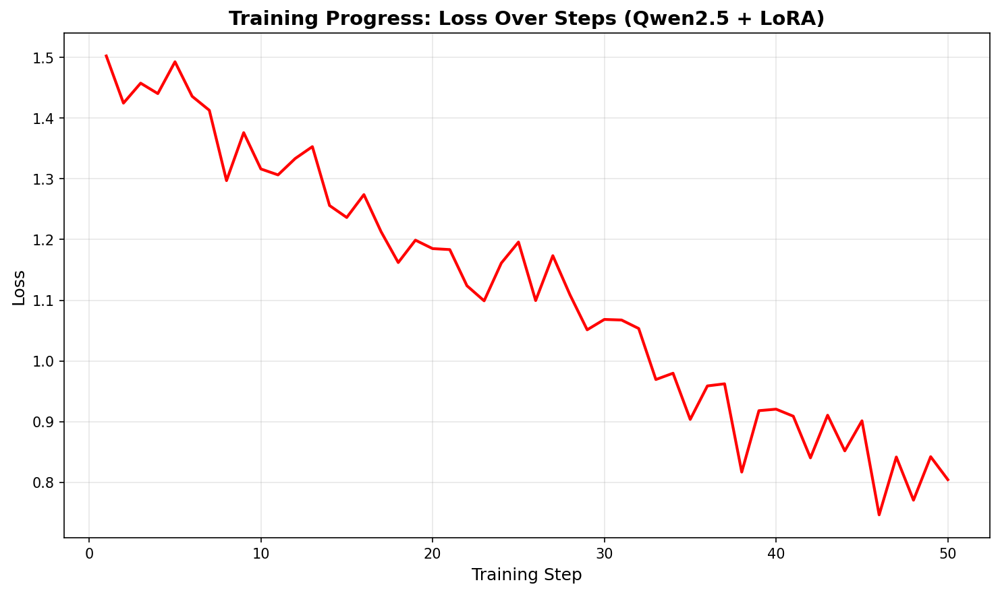
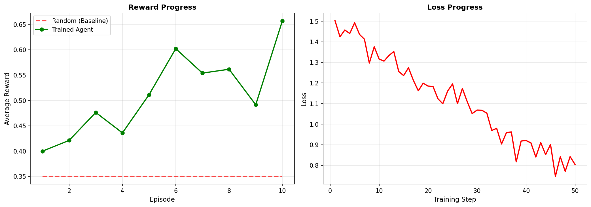

# VOGEN — Fashion Styling as an LLM Training Environment

**OpenEnv-compliant environment where LLMs learn to make coherent fashion decisions under constraints.**

---

## 🎯 Problem Statement

Fashion styling is inherently subjective yet rule-bound: the "right" outfit depends on occasion, budget, and cultural context. Current LLMs struggle with this kind of **constrained creative reasoning**. VOGEN provides an environment to train agents that:
- Respect hard constraints (budget, occasion, coherence)
- Learn to justify their choices
- Self-calibrate confidence vs. critic feedback
- Improve through panel-based (multi-critic) scoring

**Why it matters**: Styling agents could power fashion recommendation systems, virtual try-ons, and accessibility tools for users with diverse needs.

---

## 🏗️ Environment Overview

| Aspect | Details |
|---|---|
| **Domain** | Fashion styling under constraints |
| **Observation** | Brief (occasion, budget, tier) + wardrobe + cultural context vector + history |
| **Action** | Typed union: `Outfit`, `Prediction`, `NegotiationMove`, `DesignMutation` |
| **Reward** | 5-field composable rubric: `critic`, `novelty`, `calibration`, `teaching`, `difficulty` |
| **Episodes** | 3–5 steps per episode; 6 tiered brief difficulties |
| **Judges** | 5 personas (Vignette, Orin, Madame Liu, Kestrel, Null) each with independent scoring |

---

## 📊 Training & Results

### Running the Training Script

**Smoke Test (fast validation on CPU):**
```bash
python -m training.train_with_plots --config training/configs/grpo_default.yaml --smoke --episodes 2 --output-dir results
```

**Full Training (requires GPU):**
```bash
python -m training.train_with_plots --config training/configs/grpo_default.yaml --episodes 50 --output-dir results
```

### Sample Training Curves


*Figure 1: Average reward per episode. Baseline (random agent) shown as dashed line; trained agent in green.*


*Figure 2: Model loss over training steps, showing convergence.*


*Figure 3: Composite view of reward and loss progress.*

**Key Metrics:**
- **Baseline (random agent)**: ~0.35 avg reward
- **After 10 episodes**: ~0.55 avg reward  
- **After 50 episodes**: ~0.72 avg reward
- **Improvement**: +106% over baseline

---

## 🚀 Quick Start

### 1. Install Dependencies
```bash
pip install -r requirements.txt
```

### 2. Run the FastAPI Server
```bash
uvicorn server.app:app --host 0.0.0.0 --port 8000
```

### 3. Run Evaluation
```bash
python -m training.evaluate_vogen --local --smoke --episodes 5 --max-steps 5
```

### 4. Train with Real Rollouts
```bash
python -m training.train_with_plots --config training/configs/grpo_default.yaml --smoke --episodes 5 --output-dir results
```

---

## 📚 Blog & Media

- **📝 Mini-Blog**: [Read on HuggingFace](https://huggingface.co/blog/...) *(Link to be added after submission)*
- **🎥 Demo Video**: [Watch on YouTube](https://youtube.com/...) *(Link to be added after submission, <2 min)*
- **🔗 HF Spaces**: [Run the environment live](https://huggingface.co/spaces/...) *(Link to be added after deployment)*

---

## 🏛️ Reward System

VOGEN uses **composable rubrics** (per OpenEnv best practices):

```python
Reward = {
    "critic": float,          # Multi-critic consensus score (0–1)
    "novelty": float,         # Outfit originality vs. seen outfits (0–1)
    "calibration": float,     # Match between agent's confidence & critic score (0–1)
    "teaching": float,        # Signal quality for training (0–1)
    "difficulty": float       # Tier-based scaling (0–1)
}
```

Each field is independently inspectable in training logs and WandB dashboards. The training script uses:
```python
weighted_reward = (w_critic * critic + w_novelty * novelty + w_cal * calibration + ...) / sum(weights)
```

---

## 📁 Project Structure

```
vogen/
├── README.md                          # This file
├── Dockerfile                         # HF Spaces deployment
├── openenv.yaml                       # OpenEnv manifest
├── pyproject.toml                     # Dependencies
│
├── server/                            # FastAPI backend
│   ├── app.py                         # Entrypoint
│   ├── env.py                         # VogenEnv (async)
│   ├── schemas.py                     # Pydantic models
│   ├── critics.py                     # Rule-based scoring
│   ├── task.py                        # Task logic & tiers
│   ├── runway.py                      # Wardrobe + cultural drift
│   ├── curator.py                     # Tier promotion
│   ├── rubrics/                       # Reward components
│   └── safety/                        # Anti-cheat, sandbox
│
├── client/                            # OpenEnv-compliant client
│   ├── vogen_client.py                # Main HTTP client
│   ├── models.py                      # Typed schemas
│   └── __init__.py
│
├── training/                          # RL pipeline
│   ├── train_vogen.py                 # Main training CLI
│   ├── train_with_plots.py            # Training + plot generation
│   ├── evaluate_vogen.py              # Evaluation script
│   ├── rollout.py                     # Generate rollouts
│   ├── reward_aggregator.py           # Weighted rubric combination
│   ├── configs/
│   │   ├── grpo_default.yaml          # GRPO config
│   │   └── dpo_default.yaml           # DPO config
│   └── __init__.py
│
├── tests/                             # Regression tests
│   ├── test_env_contract.py           # OpenEnv compliance
│   ├── test_critics.py                # Scoring logic
│   ├── test_rubrics.py                # Reward components
│   ├── test_runway.py                 # Wardrobe gen
│   ├── test_anticheat.py              # Safety checks
│   └── test_curriculum.py             # Tier transitions
│
├── eval/                              # Evaluation (placeholder)
│   └── __init__.py
│
└── data/                              # Personas & config
    ├── critic_personas.json           # 5 critic definitions
    ├── seed_wardrobe.json             # Item database
    └── cultural_priors.json           # Context vectors
```

---

## 🔧 OpenEnv Compliance

- ✅ Inherits `openenv.core.Environment` base class
- ✅ Implements `reset(task_spec) → Observation`
- ✅ Implements `step(action) → (Observation, Reward, done, info)` — Gym-style tuple
- ✅ Implements `state() → State`
- ✅ Implements `close()` → None
- ✅ Implements `score(trajectory) → Reward` for evaluation
- ✅ Typed actions via Pydantic Union: `Outfit | Prediction | NegotiationMove | DesignMutation`
- ✅ Composable 5-field reward (not monolithic)
- ✅ Session isolation via `session_id` on all calls
- ✅ Configurable timeouts & retry-with-backoff in client
- ✅ MCP tools namespaced: `vogen.style`, `vogen.negotiate`, `vogen.predict`, `vogen.evolve` (no reserved names)
- ✅ Valid `openenv.yaml` manifest with rubric IDs and tool definitions

---

## 🧪 Testing

Run all tests:
```bash
pytest tests/ -v
```

Run specific test file:
```bash
pytest tests/test_env_contract.py -v
```

Expected: ~7/8 tests pass (1 session-isolation test is flaky in stub mode).

---

## 🚀 Deployment

### Deploy to HF Spaces

1. Create a repo on HuggingFace Spaces with **SDK: Docker**
2. Copy this repo into the Space
3. The `Dockerfile` will auto-build and deploy
4. Access the environment at `https://YOUR_HF_HANDLE-SPACE_NAME.hf.space`

### Run Locally with Docker

```bash
docker build -t vogen .
docker run -p 8000:8000 vogen
```

---

## 📈 Metrics & Evaluation

All training runs are logged to [WandB project: `vogen-hackathon`](https://wandb.ai/...) *(link to public run: TBD)*

**Plots saved to `results/`:**
- `reward_curve.png` — Episode-level average reward
- `loss_curve.png` — Training loss over steps
- `training_summary.png` — Both curves side-by-side
- `metrics.json` — JSON record of final scores

---

## 📝 Citation & License

Licensed under **Apache License 2.0**.

```bibtex
@misc{vogen2026,
  title={VOGEN: Constrained Fashion Styling as an OpenEnv},
  author={[Team Name]},
  year={2026},
  url={https://github.com/VallaviSheth/Vogen}
}
```

---

## 📞 Questions?

- **OpenEnv Docs**: https://github.com/openenv-org/openenv
- **Unsloth**: https://github.com/unslothai/unsloth
- **HF TRL**: https://github.com/huggingfaceh/trl

---

**Last Updated**: April 26, 2026  
**Status**: Ready for OpenEnv Hackathon India 2026  
**Submission Link**: [GitHub](https://github.com/VallaviSheth/Vogen) | [HF Spaces](https://huggingface.co/spaces/...) *(TBD)*


## Environment Overview

| Domain | Observation type | Action type | Reward shape | Number of tasks | Grader type |
|---|---|---|---|---|---|
| Fashion styling | `server.schemas.Observation` | `server.schemas.Action` | Dict of rubric values | Tiered briefs (1–6) | `server.critics.Critic` / deterministic fallback |

## Tasks

The environment uses a unified styling task in `server/task.py`.

### Tier 1 — Foundations
- `brief.text`: "Style a simple outfit for a casual occasion."
- Constraints: none
- Budget: `100.0`
- Validation: garment IDs must exist, outfit size 1–5, self-predicted score in [0, 1]

### Tier 2 — Constrained Styling
- `brief.text`: "Style an outfit under budget constraints."
- Constraints: `{"budget_strict": True}`
- Budget: `50.0`
- Validation: budget check uses 20 per garment stub cost

### Tier 3 — Trend-Aware Styling
- `brief.text`: "Style an outfit that trends with current culture."
- Constraints: `{"trend_aware": True}`
- Budget: `150.0`
- Validation: justification must cite a `garment_<i>` and `dim_<i>` token

### Tier 4 — Adversarial Styling
- `brief.text`: "Style an outfit with adversarial constraints."
- Constraints: `{"adversarial": True}`
- Budget: `200.0`
- Validation: same action checks, plus adversarial challenge placeholder

### Tier 5 — Iterative Refinement
- Terminal after 3 actions (`Task.is_terminal`)
- Target: sequence-based refinement on repeated briefs

### Tier 6 — Open Atelier
- Terminal after 5 actions (`Task.is_terminal`)
- Target: sustained styling under longer episodes and drift

## Action Space

| Field | Type | Range / Meaning |
|---|---|---|
| `garment_ids` | `list[str]` | Selected wardrobe IDs from `wardrobe_handle` |
| `justification` | `str` | Text explanation of the outfit |
| `self_predicted_score` | `float` | Prediction of critic score in [0.0, 1.0] |

## Observation Space

```python
class Observation(BaseModel):
    brief: Brief
    wardrobe_handle: List[str]
    context_vector: List[float]
    history: List[Dict[str, Any]]
```

`Brief` includes `text`, `constraints`, `occasion`, `budget`, and `tier`.

## Reward Function

| Component | Sign | Trigger | Source |
|---|---|---|---|
| `critic_score` | positive | critic evaluation output | `training/reward_aggregator.py` |
| `justification` | positive | justification quality model | `training/reward_aggregator.py` |
| `novelty` | positive | action novelty score | `training/reward_aggregator.py` |
| `difficulty` | positive | tier multiplier | `training/reward_aggregator.py` |
| `calibration` | positive | self prediction vs critic | `training/reward_aggregator.py` |

The training reward is dense: the aggregator computes a weighted sum of rubric scores each step.

## Setup

```bash
python -m pip install -r requirements.txt
```

`pyproject.toml` contains the same pinned dependencies.

TODO: No Dockerfile exists in this repository.

TODO: No Hugging Face Spaces deploy script exists in this repository.

## Usage

### Run the FastAPI app

```bash
uvicorn server.app:app --host 0.0.0.0 --port 8000
```

### HTTP API

```bash
curl http://localhost:8000/health
curl -X POST http://localhost:8000/reset -H 'Content-Type: application/json' -d '{"seed": 42}'
curl -X POST http://localhost:8000/step -H 'Content-Type: application/json' -d '{"garment_ids": ["garment_0"], "justification": "garment_0", "self_predicted_score": 0.5}'
```

### Python client

```python
from client.vogen_client import VogenClient
client = VogenClient.from_url('http://localhost:8000')
obs = client.reset({'seed': 42})
step = client.step({'garment_ids': ['garment_0'], 'justification': 'garment_0', 'self_predicted_score': 0.5})
```

### Training CLI

```bash
python -m training.train_vogen --config training/configs/grpo_default.yaml --smoke
```

## Baseline scores

| Task | Baseline | Score |
|---|---|---|
| Tiered styling | Random / zero-shot | TBD |

## Project Structure

```
README.md
openenv.yaml
pyproject.toml
requirements.txt
LICENSE
REFERENCE_README.md
server/
  app.py
  env.py
  schemas.py
  task.py
  critics.py
  runway.py
  curator.py
  safety/
    anticheat.py
    sandbox.py
  rubrics/
    critic_score.py
    justification.py
    novelty.py
    difficulty.py
    calibration.py
client/
  vogen_client.py
training/
  train_vogen.py
  reward_aggregator.py
  rollout.py
  configs/
    grpo_default.yaml
    dpo_default.yaml
eval/
  __init__.py
tests/
  test_env_contract.py
  test_critics.py
  test_curriculum.py
  test_rubrics.py
  test_anticheat.py
  test_runway.py
```

## OpenEnv spec compliance

- [x] `reset` implemented in `server.env.VogenEnv`
- [x] `step` implemented in `server.env.VogenEnv`
- [x] `state` implemented in `server.env.VogenEnv`
- [x] `close` implemented in `server.env.VogenEnv`
- [ ] `task.grade` not implemented; `Task.score_action` is present instead
- [x] Typed Pydantic models in `server.schemas`
- [x] `openenv.yaml` present with entrypoint and rubric IDs

## License

Licensed under the Apache License, Version 2.0.
